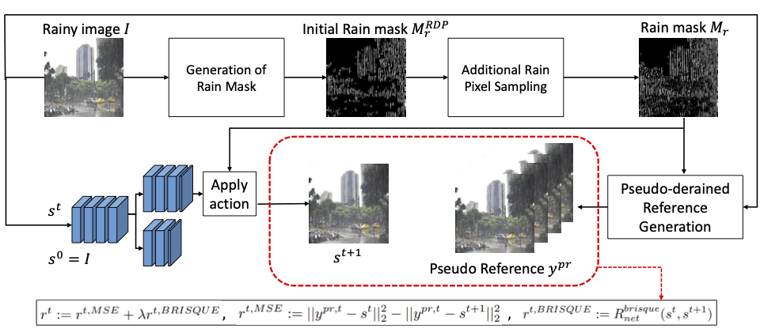
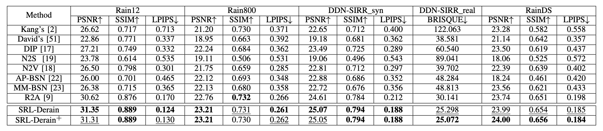

# Image Deraining via Self-supervised Reinforcement Learning (SRL-Derain)

## Architecture of SRL-Derin



## Enviornment Requirements
1. Create a virtual environment using `virtualenv`.
    ```
    virtualenv -p python3 venv
    ```
2. Install the package. (The version may be various depends on your devices.)
    ```
    source venv/bin/activate
    pip install -r requirements.txt
    ```

## Dataset preparation
1. Download datasets and sort by yourself like below structure. 
    ```
    .
    ├── datset                  
    │   ├── Rain100L                    
    │   │   ├── testing.txt
    │   │   ├── test
    │   │   │   ├── input
    │   │   │   ├── gt
    ```
2. Generate txt files which list the paths of images that you want to deal with. See `dataset/Rain100L/testing.txt` as example.

## Rain Mask Generation
This part is implemented by Matlab, which modify from the source code of [TIP 2012](https://ieeexplore.ieee.org/document/6099619).
1. Make sure the requirement packages (such as SPAMS) is installed.  
2. Modfiy `file_path` and `rain_component_path` in `rain_mask/extract_mask.m` and run it.  
3. Modfiy `src_dir` and `binary_mask_dir` in `binarization.py` and run the command
    ```
    cd rain_mask
    python binarazation.py
    ```
4. Additional Rain Pixel Sampling on RDP
    ```
    cd ../
    python additional_rain_pixel_sampling.py
    ```

## Pseudo-Derained Reference $y^{pr}$ Generation
Modify `dataset_path`, `save_path`, and `target_path` in the `stochastic_filling.py` and run the command.
```
python stochastic_filling.py
```
## RL-based Self-supervised Deraining Scheme
We have two method, SRL-Derain and SRL-Derain $^+$ for single image deraining.
### SRL-Derain
```
python main_srl_derain.py
```

### SRL-Derain $^+$
1. pretrain the $R_{net}$ $^+$ by the whole testing set.
    ```
    python pretrain_rnet_plus.py
    ```
2. use the pretrained $R_{net}$ $^+$ to guide the SRL-Derain $^+$.
    ```
    python main_srl_derain_plus.py
    ```

## Multiple training strategy
In ablation study, we also provide the derained results by using multiple training strategy, where the agents are train on training set and inference on testing set.
Note that we use $R_{net}$ $^+$ as reward predictor, which is trained on training set.
```
python pretrain_rnet_plus.py --data_path './dataset/Rain100L/training.txt' --save_dir_path './Results/Rain100L/train/Rnet+/'

python main_multiple.py --mode 'train' --data_path './dataset/Rain100L/training.txt' --save_dir_path './Results/Rain100L/test/SRL-Derain+_multiple/'
 
python main_multiple.py --mode 'test' --data_path './dataset/Rain100L/testing.txt' --save_dir_path './Results/Rain100L/test/SRL-Derain+_multiple/derained_result/' --model_weight_path './Results/Rain100L/test/SRL-Derain+_multiple/model_weight/model.npz' 

```

## Evaluation

* We evaluate image deraineing results in MATLAB, please modify `path`, `file_path`, and `gt_path` to your path.

```
./Metrics/evaluate_PSNR_SSIM.m
python Metrics/comput_brisque.py
```

## Results
